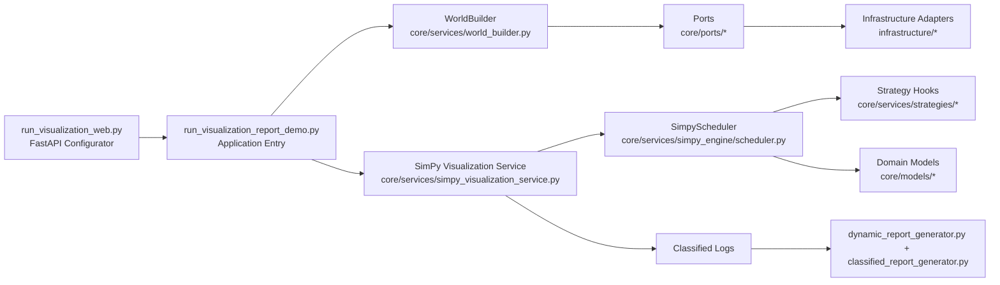

# HTM EV Simulator Project Architecture

## 1. Project Overview

This project simulates HTM electric bus operations and charging behavior, then generates a web-based visualization report.

Main goals:
- Run planning + fleet + charging simulation with configurable strategies.
- Keep core logic in hexagonal architecture (domain-centric, adapter-driven).
- Export classified logs (`bus_log`, `planning_log`, `laadinfra_log`) for report rendering.
- Provide a FastAPI-based configurator UI to run simulations and inspect status.

---

## 2. Architecture (Hexagonal)

### Layer responsibilities

- `src/backend/core/models/` (Domain layer)
  - Business entities and invariants (`Bus`, `Journey`, `Connector`, `World`).
- `src/backend/core/ports/` (Application contracts)
  - Abstract interfaces for planning/bus/infrastructure providers.
- `src/backend/infrastructure/` (Adapters)
  - Concrete IO integrations (ADLS, Maximo, OMNIplus, JSON infra).
- `src/backend/core/services/` (Use-case orchestration)
  - Build world, run simulation, apply strategies, emit logs.
- `src/frontend/visualization/` (Presentation/report)
  - Convert logs into HTML sections and dynamic report data.

---

## 3. Module Relationships

## 3.1 Entrypoints

- `run_visualization_web.py`
  - Serves configurator UI and status pages.
  - Launches `run_visualization_report_demo.py` as subprocess.

- `run_visualization_report_demo.py`
  - Parses runtime parameters.
  - Builds data providers and world.
  - Runs simulation service.
  - Calls dynamic report generator.

### 3.2 Backend core

- `world_builder.py`
  - Uses ports/adapters to load buses, blocks, locations, grids.
  - Links planning points with charging locations.

- `simpy_visualization_service.py`
  - SimPy-only simulation service.
  - Initializes strategies + allocator + scheduler.
  - Returns legacy-compatible `VisualizationSimulationResult`.

- `simpy_engine/scheduler.py`
  - Executes block/journey lifecycle.
  - Applies low-SOC rules, charging, replacement hooks.
  - Emits classified logs used by report pipeline.

- `simpy_engine/resource_allocator.py`
  - Enforces location power cap rules (notably Telexstraat/30002).
  - Computes per-slot allocation under location budget.

- `strategies/loader.py`
  - Auto-discovers strategy classes from `strategies/` folder.
  - Runs `before_journey` and `after_journey` hooks.

### 3.3 Frontend report generation

- `dynamic_report_generator.py`
  - Writes dynamic report shell and JSON payloads.
  - Calls section generators.

- `classified_report_generator.py`
  - Builds summary, planning detailed, laadinfra detailed, replay map sections.

- `bus_status_generator.py`
  - Builds interactive “Bus Status Over Time” table and playback timeline.

- `connector_status_generator.py`
  - Builds connector-level status playback and collapsible layout.

---

## 4. Core Data Flow

1. Config submitted in web UI (`/run`).
2. Runner loads providers:
   - Planning: parquet/stub.
   - Buses: OMNIplus/Maximo/stub.
   - Charging infra: JSON adapter.
3. `WorldBuilder` builds `World` aggregate.
4. SimPy service runs scheduler:
   - Assign buses -> execute journeys -> update SOC/location/state.
   - Apply strategies (replacement, opportunity charging, full SOC, power limit).
   - Emit classified logs.
5. Frontend generators consume logs + world to render report.

---

## 5. Function Reference (Main Modules)

This section explains the primary functions and classes currently used in production flow.

## 5.1 `run_visualization_report_demo.py`

- `def _ensure_src_on_path()`
  - Adds `src/` to Python import path.
- `def _stage(message)`
  - Emits structured stage logs for web status page.
- `class DemoSimulationConfig`
  - Carries simulation window/config metadata for report generation.
- `class StubBusProvider`, `class StubPlanningProvider`, `class MaximoBusProvider`
  - Temporary/adapter-composition providers for simulation inputs.
- `def _build_parser()`
  - Defines CLI arguments and strategy toggles.
- `def _load_omniplus_client_from_env()`
  - Builds OMNIplus client from environment credentials.
- `def _build_planning_provider(...)`
  - Selects planning data source (real/stub).
- `def _build_bus_provider(...)`
  - Selects bus source and VIN mapping flow.
- `def _safe_build_provider_pair(...)`
  - Applies fallback-to-stub if adapter setup fails.
- `def main()`
  - Complete end-to-end pipeline: build world -> simulate -> generate report.

## 5.2 `run_visualization_web.py`

- `class SimulationJob`
  - Tracks async simulation process state/output.
- `_build_form_page(...)`
  - Builds configurator HTML.
- `_extract_current_stage(...)`
  - Parses stage markers from subprocess stdout.
- `_build_status_page(job)`
  - Builds live status page with stdout/stderr and report link.
- `_build_runner_args(form)`
  - Converts web form fields into CLI args for runner.
- `_read_report_file/_read_json_file/_read_html_file`
  - Safe file readers for report shell/data/parts endpoints.
- `_run_job(job_id, args)`
  - Executes report runner subprocess and streams logs.
- `main()`
  - Starts FastAPI/Uvicorn server.

## 5.3 `core/services/world_builder.py`

- `class WorldBuildResult`
  - Wrapper around built world and optional diagnostics.
- `class WorldBuilder`
  - Central orchestrator to build `World` from ports.
- `_iter_journeys(blocks)`, `_iter_points(journeys)`
  - Utility iterators for linking and indexing.

## 5.4 `core/services/simpy_visualization_service.py`

- `class VisualizationSimulationService`
  - SimPy-first simulation service used by runner.
  - Initializes scheduler/resources/strategies.
  - Produces `VisualizationSimulationResult` contract expected by frontend.

## 5.5 `core/services/simpy_engine/scheduler.py`

- `class SimpyScheduler`
  - Main event scheduler for journey and charging lifecycle.

Key methods:
- `_point_to_location(point)`
  - Normalizes domain point into location dict for logs.
- `_connector_status(connector)`
  - Returns connector status string (enum/string-safe).
- `_find_point_by_id(world, point_id)`
  - Finds planning point by point ID.
- `_build_virtual_garage_point(world)`
  - Constructs fallback garage point (30002) when needed.
- `_is_garage_destination_journey(journey)`
  - Detects garage-destination journeys (used for SOC bypass rule).
- `_release_bus_connector(bus)`
  - Frees occupied connector when bus departs.
- `_select_connector(location)`
  - Chooses first available connector for charging.
- `_select_bus_for_time(...)`
  - Picks candidate bus by availability + SOC ordering.
- `_can_complete_journey(bus, journey)`
  - Precheck energy sufficiency (garage-destination can bypass SOC gate).
- `_log_precheck_replacement(...)`
  - Logs replacement workflow events.
- `_charge_until(...)`
  - Simulates charging steps and emits charging logs.
- `_maybe_charge(...)`
  - Wrapper to charge with defaults/deadline.
- `_simulate_journey(...)`
  - Simulates one journey: points, SOC updates, low-SOC skip logic, journey events.
- `run(env, blocks, buses)`
  - Full block/journey execution loop with strategy hooks.

## 5.6 `core/services/simpy_engine/resource_allocator.py`

- `class LocationPowerAllocator`
  - Location-level power budget allocator.

Key methods:
- `reset()`
  - Clears timeslot allocation state.
- `_location_power_limit_kw(location, time_ts)`
  - Resolves applicable location cap (Telexstraat logic).
- `location_current_load_kw(location)`
  - Computes current location aggregate load.
- `allocate_power_kw(...)`
  - Returns per-connector power under connector+location+timeslot constraints.
- `apply_energy(bus, power_kw, dt_seconds)`
  - Converts power/time to energy and updates bus SOC.

## 5.7 Strategies (`core/services/strategies/*`)

- `base.py`
  - `StrategyRuntimeState`: mutable context for one journey step.
  - `SimulationStrategy` protocol: hook interface.
- `loader.py`
  - `_iter_strategy_classes()`: runtime discovery.
  - `build_enabled_strategies(flags)`: instantiate enabled strategies.
  - `run_before_journey(...)`, `run_after_journey(...)`: hook execution.
- `precheck_replacement_strategy.py`
  - Pre-journey SOC replacement strategy with garage + series rules.
- `opportunity_charging_strategy.py`
  - Charges during eligible layovers.
- `start_full_soc_strategy.py`
  - Sets all buses SOC to 100 at simulation start.
- `power_limit_strategy.py`
  - Toggle strategy for location power cap behavior.

## 5.8 Domain models (key files)

- `core/models/transport/bus/bus.py`
  - `Bus` entity: SOC state, range, charging acceptance.
  - Key functions:
    - `update_soc(...)`
    - `remaining_range_km()`
    - `has_low_soc(...)`
    - `calculate_actual_charging_power_kw(...)`

- `core/models/transport/bus/charging_curve.py`
  - `ChargingCurve` acceptance envelope model.
  - Key functions:
    - `clamp_soc_percent(...)`
    - `power_cap_kw(...)`
    - `actual_battery_power_kw(...)`

- `core/models/laad_infra/connector.py`
  - `Connector` state machine (`available`, `charging`, `connected`).
  - Key functions:
    - `connect_bus(...)`
    - `set_charging()`
    - `set_connected()`
    - `disconnect_bus()`

- `core/models/world.py`
  - Aggregate root and indexes for buses/blocks/infra.
  - Key functions:
    - add/get methods for entities
    - `connect_location_to_grid(...)`
    - `attach_locations_to_points(...)`

## 5.9 Frontend visualization generators

- `dynamic_report_generator.py`
  - `generate_dynamic_report(...)`: master report output.
  - `_build_bus_snapshots(...)`: timeline snapshots for bus state.
  - `_build_summary(...)`: aggregate summary metrics.
  - `_enrich_planning_log_with_soc(...)`: enrich planning events with SOC context.

- `classified_report_generator.py`
  - `generate_combined_report_from_classified_logs(...)`
  - `generate_summary_section(...)`
  - `generate_planning_detailed_section(...)`
  - `generate_breakdown_table_body(...)`
  - `generate_laadinfra_detailed_section(...)`
  - `generate_replay_map_from_classified_logs(...)`

- `bus_status_generator.py`
  - `generate_bus_status_section(...)`: interactive bus status playback.
  - `_downsample_timeline(...)`: guards browser performance on dense timelines.

---

## 6. Current Strategy Plug-and-Play Rules

To add a new strategy without editing the simulation main flow:
1. Create a new file under `src/backend/core/services/strategies/`.
2. Implement class with:
   - `strategy_key`
   - `before_journey(service, state)`
   - `after_journey(service, state)`
3. Enable with runtime flag matching `strategy_key`.
4. Ensure any host methods used exist on `SimpyScheduler`.

---

## 7. Important Runtime Outputs

- `outputs/json/bus_log.json`
  - Bus state/SOC/location timeline.
- `outputs/json/planning_log.json`
  - Journey/block/replacement/skip events.
- `outputs/json/laadinfra_log.json`
  - Charging and connector status timeline.
- `outputs/combined_visualization_report*.html`
  - Final report shells.

---

## 8. Notes for Future Refactor (Phase 2)

- Introduce explicit application use-case class for runner orchestration.
- Extract a formal `StrategyHost` interface for scheduler callable methods.
- Add regression tests for:
  - low-SOC interruption semantics,
  - Telexstraat power cap,
  - report label consistency (`SKIPPED` vs `NOT_STARTED`),
  - charging status transitions at 100% SOC.

